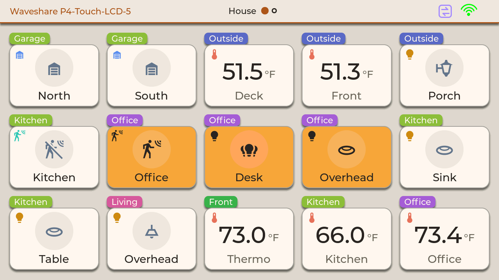
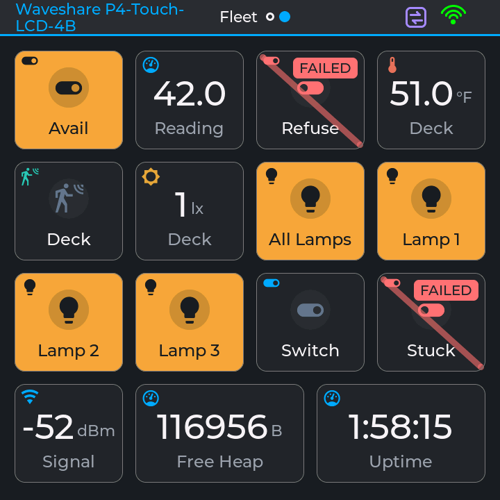
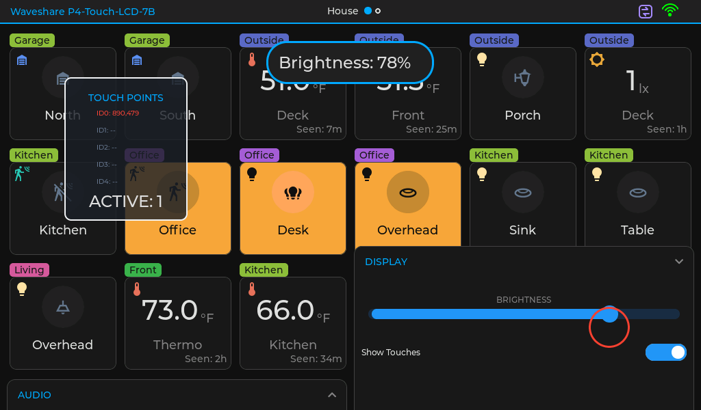
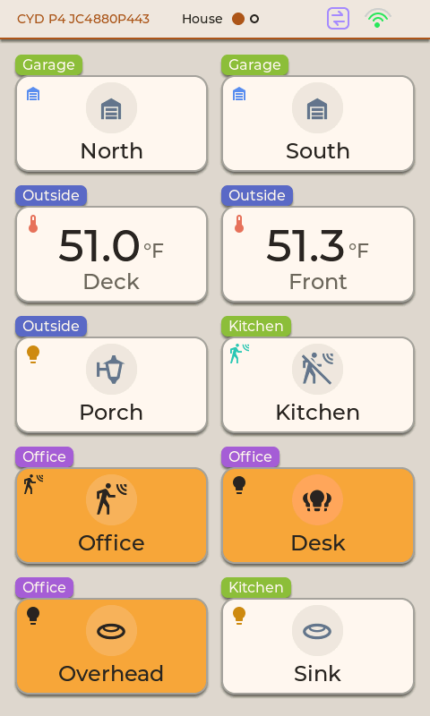

# ESP32 Voice Assistant Fleet

Modular desktop firmware for a fleet of ESP32-S3 and ESP32-P4 touchscreen panels - wall-mounted
Home Assistant dashboards today, local voice assistants later. Nine boards from Waveshare and
Guition, 3.5" to 7", one codebase, the board picked at build time.

**Status:** hobby project in active development (`v0.2.7`, Phase 2 of the
[roadmap](docs/ROADMAP.md)). The dashboard runs on every board; voice is on the roadmap for later.
MIT licensed - see [License](#license).

<p align="center">
  
  <br><em>The House page on the 5" Waveshare P4 (1280x720), in the light Linen scheme - the owner's
  Home Assistant entities, grouped by area.</em>
</p>

## The dashboard idea

The screen is a grid of **cards**, and every card is bound to an **entity** - a light, a
temperature, a door, the panel's own Wi-Fi signal. Entities come from **providers** that write into
one thread-safe registry: Home Assistant over its websocket API, MQTT (Zigbee2MQTT and friends),
and the panel's own telemetry, which it publishes back to Home Assistant through MQTT discovery.
Cards render whatever the registry holds, and grey out when a value goes stale.

Pages are declared as data: a list of card specs, each with a label, an area and a **priority**.
The grid is derived from the screen itself - a card has a target width in millimetres, the panel's
real pixel density gives the column count, and when a small screen runs out of room the
lowest-priority cards drop first. One page definition gives 7 columns on a 7" panel and 2 on a
3.5" portrait one: the same page, trimmed to fit. Swipe between pages; tap a card to toggle it
(long-press controls - brightness, colour - are next on the roadmap).

<p align="center">
  
  <br><em>The Fleet page on the 4" 720x720 P4, Midnight scheme: switches, lamps, a sensor with its
  lux reading, the panel's own telemetry, and two test switches showing a command that failed.</em>
</p>

## What makes it interesting

- **One codebase, nine boards.** Each board is a single header (`BSP_<BOARD>.h`) of flat `const`
  structs - display, touch, audio, storage - that app code reads through fixed names
  (`bsp_display.WIDTH`). Adding a board takes a header and a build environment.
- **UI sized from physics.** Text and touch targets are sized from each panel's measured pixels per
  inch, so they come out the same size in millimetres from 165 to 294 PPI. Design tokens (colour,
  spacing, type) live in one header, and three colour schemes switch live.
- **A display stack moved to raw `esp_lcd`**, board by board, measured at every step. On the P4s
  the hardware 2D engine (PPA) rotates each strip while LVGL draws the next, with triple buffering
  and an on-device check that the glass shows exactly what LVGL rendered. Full-screen redraws went
  from 163 to 85 ms on the 5" P4. Each board's frame-delivery mode is derived from its bus and
  rotation, and its panel driver is picked by name from the board header.
- **Verified from outside the device.** Every board serves `/screenshot` (a PNG of the screen) and
  `/bench` (draw and flush timing, animation traces, a frame-buffer check), and a built-in
  **System Doctor** reports firmware, memory, network, display, power and I2C on screen and serial.
- **ESP-IDF first.** Arduino-ESP32 is the framework today; new code uses ESP-IDF facilities
  (`esp_lcd`, `esp_http_server`, the oneshot ADC driver) to keep a future move to pure ESP-IDF
  straightforward.

<p align="center">
  
  <br><em>The 7" 1024x600 P4 with the Display panel open: live brightness, and the Show Touches
  overlay tracking a finger on the slider.</em>
</p>

## The boards

| Environment | Board | SoC | Screen |
|---|---|---|---|
| `WS_P4_TOUCH_LCD_7B` | Waveshare ESP32-P4-WIFI6-Touch-LCD-7B | P4 + C6 | 7" 1024x600 MIPI-DSI |
| `WS_P4_TOUCH_LCD_5` | Waveshare ESP32-P4-WIFI6-Touch-LCD-5 | P4 + C6 | 5" 720x1280 MIPI-DSI |
| `WS_P4_TOUCH_LCD_4B` | Waveshare ESP32-P4-WIFI6-Touch-LCD-4B | P4 + C6 | 4" 720x720 MIPI-DSI |
| `CYD_P4_1060P470` | Guition JC1060P470 | P4 + C6 | 7" 1024x600 MIPI-DSI |
| `CYD_P4_4880P443` | Guition JC4880P443 | P4 + C6 | 4.3" 480x800 MIPI-DSI |
| `WS_S3_TOUCH_LCD_4B` | Waveshare ESP32-S3-Touch-LCD-4B | S3 | 4" 480x480 RGB |
| `WS_S3_TOUCH_LCD_5B` | Waveshare ESP32-S3-Touch-LCD-5B | S3 | 5" 1024x600 RGB |
| `CYD_S3_8048W550` | Guition JC8048W550 | S3 | 5" 800x480 RGB |
| `CYD_S3_3248W535` | Guition JC3248W535 | S3 | 3.5" 320x480 QSPI |

Per-board status and quirks: [docs/HARDWARE_STATUS.md](docs/HARDWARE_STATUS.md) and, for the
display, [docs/display/README.md](docs/display/README.md).

<p align="center">
  
  <br><em>The same House page on the 4.3" Guition P4 in portrait (480x800): two columns, derived
  from the screen, with the lowest-priority cards left off.</em>
</p>

## How it is built

- **PlatformIO** with [pioarduino](https://github.com/pioarduino/platform-espressif32)
  (Arduino-ESP32 3.3 on ESP-IDF 5.5), **LVGL 9.5**, one environment per board.
- **Layers.** `src/main.cpp` holds `setup()` and `loop()`. `SystemCore` owns the hardware and every
  subsystem below the UI; `LVGL_Startup` owns the LVGL engine; `GUIManager` owns what is on screen.
  UI code registers itself with the layers below it, and data reaches LVGL through the entity
  registry, so the hardware side stays free of UI code.
- **Components** (`components/`): `Fleet_BSP` (the board headers), `Fleet_Display` (the esp_lcd
  stack and vendored panel drivers), `Fleet_Entities` (the registry), `Fleet_Providers`,
  `Fleet_HA`, `Fleet_MQTT`, `Fleet_Connectivity`, `AudioManager`, `TouchManager`, plus two
  submodules: LVGL and a fork of Arduino_GFX (being retired board by board).

### Building

```
git clone --recurse-submodules https://github.com/psyfiend/ESP32-Voice-Assistant-Fleet.git
pio run -e WS_P4_TOUCH_LCD_5 -t upload --upload-port COMx
```

Good to know first:

- `platformio.ini` links the local libraries by **absolute path**; edit the prefix to match where
  you clone it (the reasons are in [CLAUDE.md](CLAUDE.md)).
- Wi-Fi, MQTT and Home Assistant credentials go in two git-ignored headers,
  `components/Fleet_Connectivity/ConnectivityLocalSecrets.h` and
  `components/Fleet_MQTT/MqttLocalSecrets.h`; the matching `*Defaults.h` files describe them. A
  board without them boots and shows local content.
- The P4 boards run on **rebuilt** framework libraries that fix Wi-Fi dropouts on the C6
  co-processor link ([docs/REBUILD_P4_LIBS.md](docs/REBUILD_P4_LIBS.md)).

## Documentation

| | |
|---|---|
| [CLAUDE.md](CLAUDE.md) | How the HAL, the BSP and the rest work - the stable reference |
| [docs/HANDOFF.md](docs/HANDOFF.md) | Where development is right now |
| [docs/ROADMAP.md](docs/ROADMAP.md) | What is being built, and in what order |
| [docs/LESSONS.md](docs/LESSONS.md) | Hard-won lessons |
| [docs/display/](docs/display/README.md) | The display stack |
| [docs/design/](docs/design/) | Cards, pages, tokens, startup and the rest of the UI design |

## License

[MIT](LICENSE) for this project's own code. Third-party code in this repository keeps its own
license, stated in its files or beside them:

| Code | License |
|---|---|
| `components/lvgl` | MIT |
| `components/GFX_Library_for_Arduino` (fork of Arduino_GFX) | BSD, per its `license.txt` |
| `components/bb_captouch_fork` (BitBank) | Apache-2.0 |
| `components/SensorLib`, `components/XPowersLib` | MIT |
| `components/esp_websocket_client` (Espressif) | Apache-2.0 |
| Espressif panel, expander and 3-wire SPI drivers in `components/Fleet_Display` | Apache-2.0 |
| Waveshare panel drivers in `components/Fleet_Display` | MIT |
| ES7210 / ES8311 codec drivers in `components/AudioManager` (adapted from Espressif) | Apache-2.0 |

Fonts keep their own licenses too.

Built with a great deal of help from Claude.
